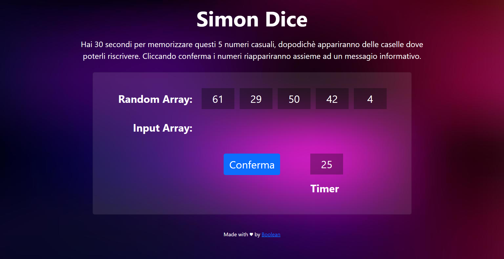

# JS Simon-says

**Initial commit**: 01/03/23

**Tecnologie**: Javascript, HTML, CSS e Bootstrap.

**Info**: :game_die: Here is Simon-says, Simon shows us on the screen 5 numbers in a row and will give us 30 seconds to memorize them after which he will ask us to enter them again. The game is not suitable for those with the memory of a goldfish :fish:

## Milestone

- Display 5 random numbers on the page.
- Start a 30-second timer.
- When the timer expires the numbers disappear and the user will have to re-enter them.
- Initially I used the `prompt()` to prompt for numbers.
- After the 5 numbers have been entered, the software says how many and which of the numbers have been identified.
- Finally, instead of `prompt()` and `alert()` I used html elements to insert and display the result on the screen.
