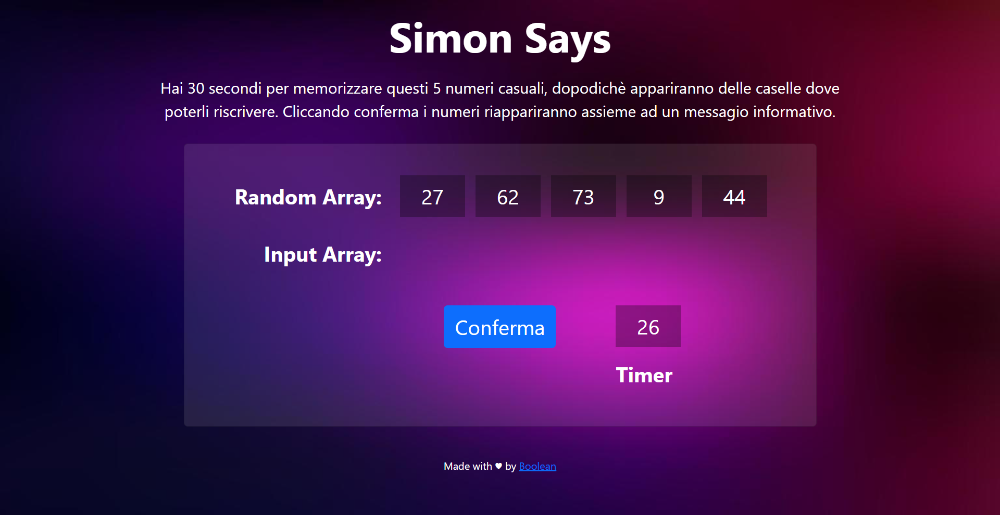

# js Simon-says

:game_die: Ecco a voi Simon-says, Simon ci mostra a schermo 5 numeri in fila e ci darà 30 secondi per memorizzarli dopodichè ci chiederà di reinserirli. Gioco non adatto a chi ha la memoria di un pesciolina rosso :fish:

## Milestone

-   Visualizzare in pagina 5 numeri casuali.
-   Far partire un timer di 30 secondi.
-   Allo scadere del timer i numeri scompaiono e l'utente dovrà reinserirli.
-   Inizialmente ho usato il `prompt()` per richiedere inumeri.
-   Dopo che sono stati inseriti i 5 numeri, il software dice quanti e quali dei numeri sono stati individuati.
-   Per finire al posto del `prompt()` e `allert()` ho usato degli elementi html per inserire e mostrare a schermo il risultato.
